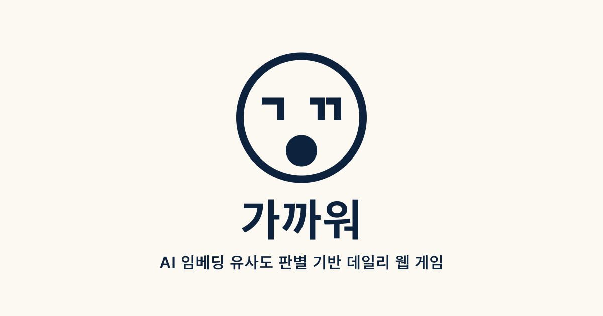
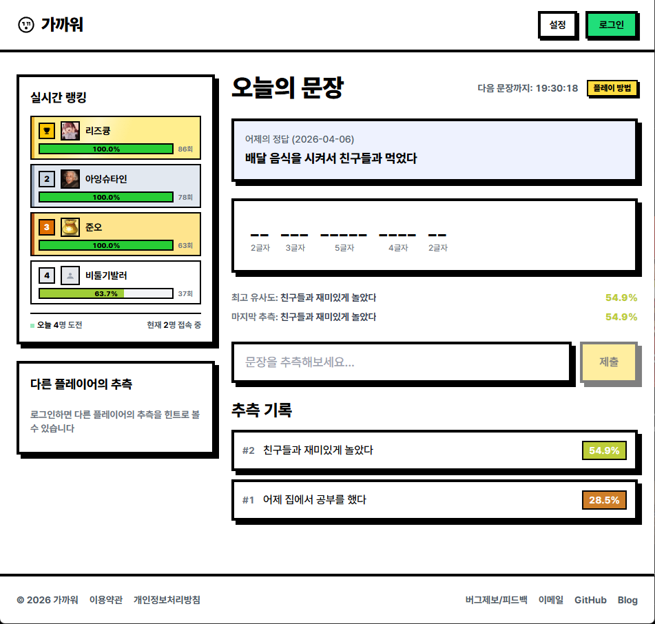
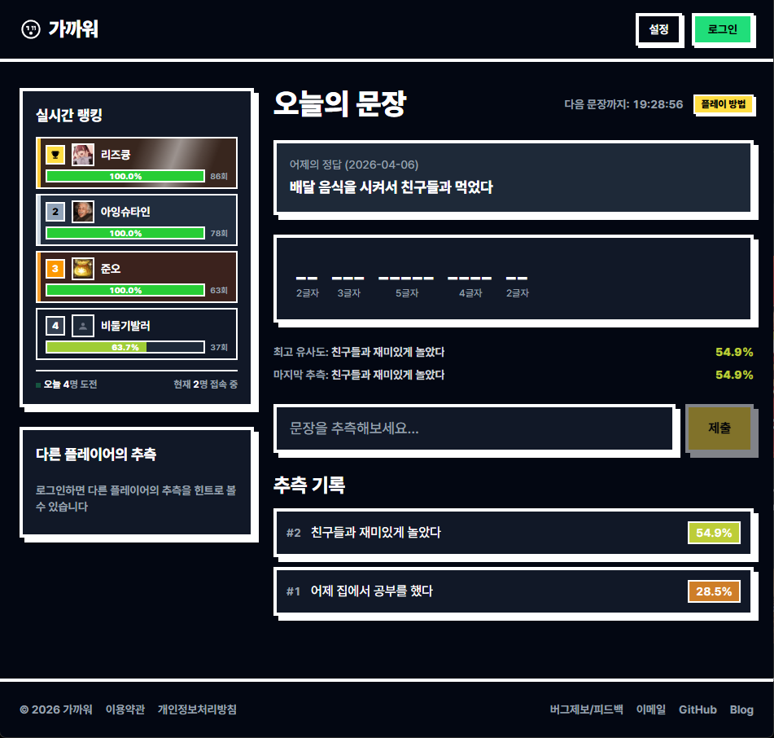
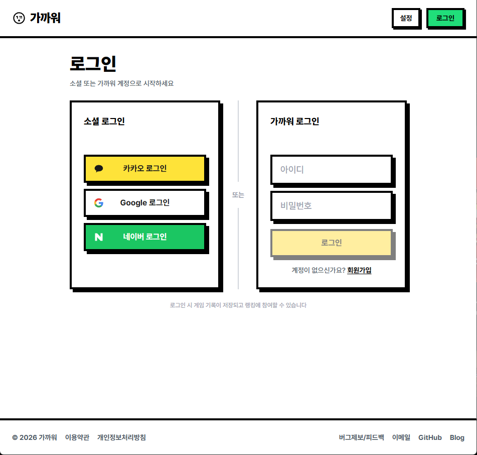
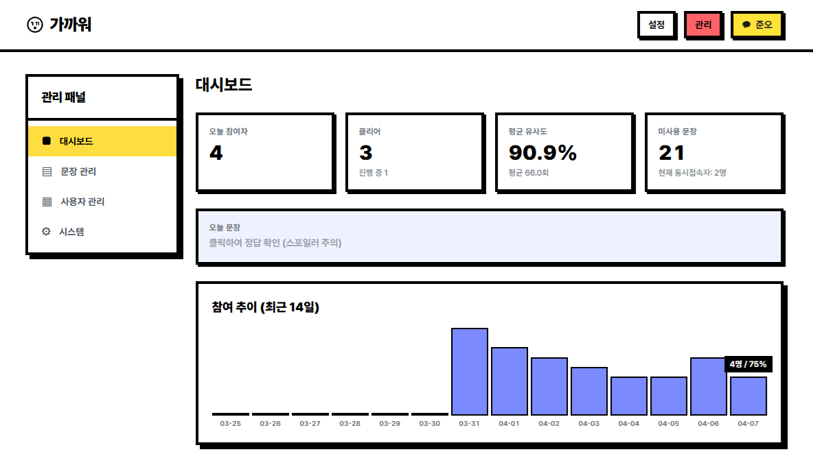
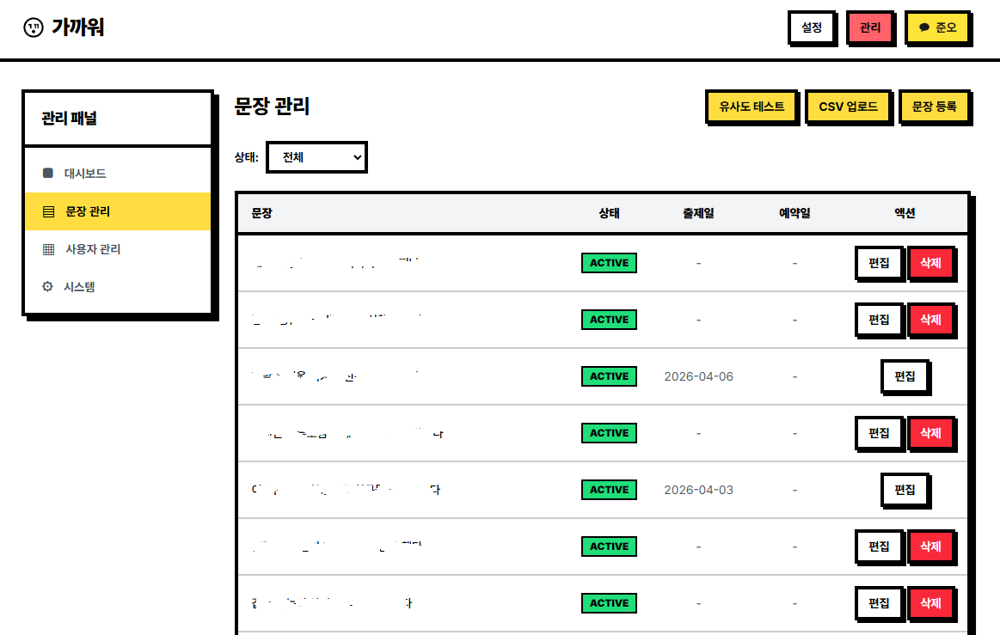
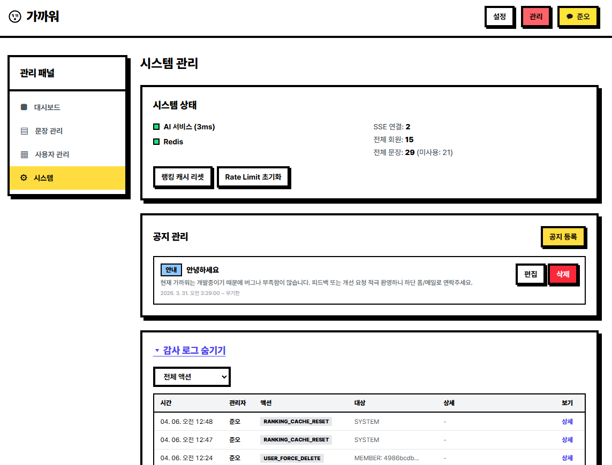
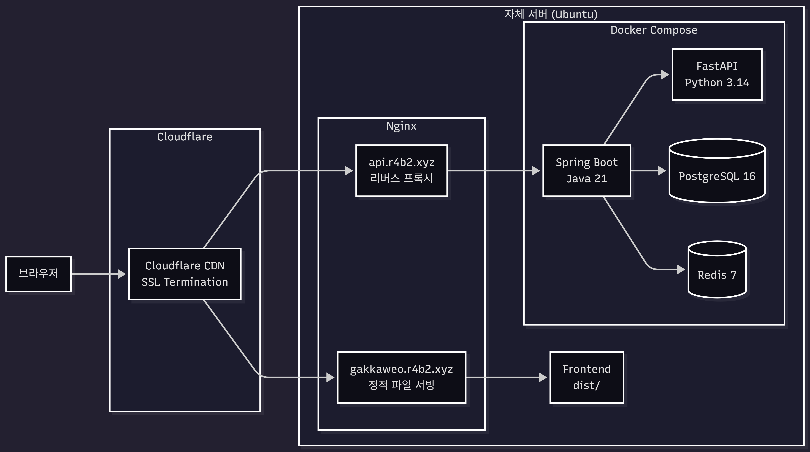
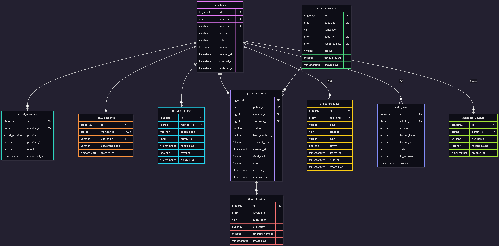

<div align="center">



# 가까워 - AI 유사도 기반 게임

AI 임베딩 유사도 판별 기반 데일리 웹 게임입니다. 세멘틀(Semantle), 꼬멘틀, 뉴멘틀, 끄투 등 단어/문장 유추 장르에서 영감을 받아 한국어 문장 의미 유사도에 특화된 일일 챌린지를 제공합니다.

**문장의 의미**를 비교하기 때문에, 같은 뜻의 다른 표현으로도 높은 점수를 받을 수 있습니다.

[](https://github.com/RabeMaster/gakkaweo/actions/workflows/ci.yml)
[](https://github.com/RabeMaster/gakkaweo/actions/workflows/cd.yml)


[웹사이트 (운영중)](https://gakkaweo.r4b2.xyz) · [API 명세](docs/api-spec.md) · [디자인 시스템](docs/design-system.md) · [기술 의사결정](docs/decisions/)

</div>

---

## 스크린샷

|                      라이트 모드                       |                      다크 모드                      |
| :----------------------------------------------------: | :-------------------------------------------------: |
|  |  |

|                로그인                 |            어드민 대시보드            |
| :-----------------------------------: | :-----------------------------------: |
|  |  |

|                     어드민 문장 관리                      |                    어드민 시스템                    |
| :-------------------------------------------------------: | :-------------------------------------------------: |
|  |  |

---

## 주요 기능

**게임**

- 매일 자정(KST) 새 문장 출제, AI 유사도 기반 추측
- 95% 이상 달성 시 클리어, 클리어 후에도 100% 도전 가능
- 추측 히스토리 및 최고 유사도 피드백
- 다른 플레이어의 추측을 참고할 수 있는 힌트 시스템

**랭킹**

- SSE 기반 실시간 랭킹 업데이트
- 100% 달성자 선착순 -> 유사도 -> 시도 횟수 순 정렬
- Redis Sorted Set 스코어 인코딩

**인증**

- Kakao / Google / Naver 소셜 로그인
- 자체 계정 (아이디/비밀번호) 로그인 및 회원가입
- JWT Cookie + Refresh Token Rotation

**어드민**

- 대시보드 (오늘 현황, 추이 차트, 추측 로그)
- 문장 관리 (등록, CSV 업로드, 스케줄, 긴급 교체, 유사도 테스트)
- 사용자 관리 (역할 변경, 차단, 강제 탈퇴)
- 시스템 관리 (공지, 캐시 리셋, 감사 로그)

---

## 기술 스택

| 레이어           | 기술                                                                                                          |
| ---------------- | ------------------------------------------------------------------------------------------------------------- |
| **Frontend**     | React 19, TypeScript 5.9, Tailwind CSS 4, Vite 8, React Router 7, Zustand 5, TanStack Query 5                 |
| **Backend**      | Spring Boot 3.5, Java 21, Spring Security, Spring Data JPA, Flyway, Bucket4j, Resilience4j                    |
| **AI Service**   | FastAPI, Python 3.14, sentence-transformers ([jhgan/ko-sbert-sts](https://huggingface.co/jhgan/ko-sbert-sts)) |
| **Database**     | PostgreSQL 16, Redis 7                                                                                        |
| **Infra**        | Docker Compose, Nginx (reverse proxy), Cloudflare (Full Strict SSL)                                           |
| **Deployment**   | Self-hosted Ubuntu server (Docker-based), GitHub Container Registry, SSH/SCP deployment scripts               |
| **CI/CD**        | GitHub Actions                                                                                                |
| **Code Quality** | ESLint + Prettier (FE), Spotless + Google Java Format (BE), Ruff (AI), Husky + lint-staged                    |
| **Tools**        | IntelliJ IDEA, VS Code, Postman, pgAdmin, RedisInsight, ChatGPT, Gemini, Copilot, Claude                      |

---

## 아키텍처



---

## ERD



---

## 프로젝트 구조

```
gakkaweo/
├── frontend/                    # React 19 + TypeScript
│   └── src/
│       ├── app/                 # 레이아웃, 라우터, 가드
│       ├── features/            # 기능 모듈
│       │   ├── admin/           #   어드민 패널
│       │   ├── auth/            #   인증 (로그인, 회원가입, 마이페이지)
│       │   ├── game/            #   게임 (추측, 피드백, 힌트)
│       │   └── ranking/         #   실시간 랭킹
│       ├── pages/               # 라우트 페이지
│       └── shared/              # 공용 (API, 스토어, UI, 유틸)
│
├── backend/                     # Spring Boot 3.5 + Java 21
│   └── src/main/java/.../backend/
│       ├── admin/               # 어드민 API
│       ├── auth/                # 인증 (JWT, OAuth2)
│       ├── domain/              # 엔티티 + 리포지토리
│       │   ├── admin/           #   Announcement, AuditLog
│       │   ├── auth/            #   RefreshToken
│       │   ├── game/            #   GameSession, DailySentence, GuessHistory
│       │   └── member/          #   Member, SocialAccount, LocalAccount
│       ├── game/                # 게임 로직
│       ├── ranking/             # 랭킹 (Redis Sorted Set)
│       └── ratelimit/           # Rate Limiting (Bucket4j)
│
├── ai-service/                  # FastAPI + sentence-transformers
│   └── app/
│       ├── main.py              # API 엔드포인트
│       ├── model.py             # 모델 로딩 + 유사도 계산
│       └── normalize.py         # 텍스트 정규화
│
├── nginx/                       # Nginx 설정
│   ├── gakkaweo.conf            # 프론트엔드 (SPA 서빙)
│   └── api.conf                 # 백엔드 (리버스 프록시)
│
├── docs/                        # 프로젝트 문서
│   ├── api-spec.md              # REST API 명세
│   ├── design-system.md         # UI/UX 디자인 시스템
│   ├── branch-strategy.md       # 브랜치 전략
│   ├── commit-convention.md     # 커밋 컨벤션
│   └── decisions/               # 기술 의사결정
│       ├── infra.md             #   인프라
│       ├── backend.md           #   백엔드
│       ├── frontend.md          #   프론트엔드
│       └── ai-service.md        #   AI 서비스
│
├── docker-compose.dev.yml       # 로컬 개발 환경
└── docker-compose.prod.yml      # 프로덕션 환경
```

---

## 실행 방법

### 사전 요구사항

- Docker & Docker Compose
- Java 21 (Eclipse Temurin)
- Node.js 22+ & pnpm 10
- Python 3.14+

### 1. 환경 변수 설정

```bash
cp .env.sample .env
# .env 파일을 열어 DB, Redis, JWT, OAuth 정보를 입력하세요
```

Backend는 루트 `.env`를 심볼릭 링크로 참조합니다. clone 후 링크를 생성하세요.

```bash
# macOS / Linux
ln -s ../.env backend/.env

# Windows (관리자 권한 또는 개발자 모드 필요)
mklink backend\.env ..\.env
```

### 2. 인프라 실행 (PostgreSQL, Redis, AI Service)

```bash
docker compose -f docker-compose.dev.yml up -d
```

> AI Service는 최초 실행 시 모델(`jhgan/ko-sbert-sts`)을 다운로드합니다. 약 1~2분 소요.

### 3. Backend 실행

```bash
cd backend
./gradlew bootRun
```

서버가 `http://localhost:8080`에서 시작됩니다. Flyway가 자동으로 DB 마이그레이션을 실행합니다.

### 4. Frontend 실행

```bash
cd frontend
pnpm install
pnpm dev
```

`http://localhost:3000`에서 접속할 수 있습니다.

### 5. 초기 데이터 설정

최초 실행 시 `InitialDataSeeder`가 다음을 자동으로 처리합니다.

- **기본 문장 5개** 자동 삽입 (`backend/src/main/resources/seed/sentences.txt`). 파일을 편집해 문장을 추가·교체할 수 있으며, 중복은 자동 skip됩니다.
- `.env`에 `SEED_ADMIN_PASSWORD`(8자 이상)를 설정하면 **admin 계정이 자동 생성**됩니다 (username: `admin`, 닉네임 자동 생성). 이후 `/admin` 접근이 가능합니다.
- 비밀번호 8자 미만이거나 시드 파일이 없으면 서버 실행이 중단됩니다.

---

## 문서

| 문서                                     | 설명                                           |
| ---------------------------------------- | ---------------------------------------------- |
| [API 명세](docs/api-spec.md)             | REST API 엔드포인트, 요청/응답 포맷, 에러 코드 |
| [디자인 시스템](docs/design-system.md)   | Neo-Brutalism UI 규칙, 컴포넌트 스타일 가이드  |
| [브랜치 전략](docs/branch-strategy.md)   | main/dev 기반 브랜치 워크플로우                |
| [커밋 컨벤션](docs/commit-convention.md) | Conventional Commits 규칙                      |

### 기술 의사결정

| 문서                                      | 설명                                                  |
| ----------------------------------------- | ----------------------------------------------------- |
| [인프라](docs/decisions/infra.md)         | 홈서버, Cloudflare, 도메인, Docker Compose, CI/CD     |
| [백엔드](docs/decisions/backend.md)       | 패키지 구조, 트랜잭션 전략, 인증, 랭킹, Rate Limiting |
| [프론트엔드](docs/decisions/frontend.md)  | Feature-based 구조, 상태 관리, 디자인 시스템          |
| [AI 서비스](docs/decisions/ai-service.md) | 모델 선택, 유사도 계산, 캐싱, 정규화                  |

---

## 라이선스

[MIT License](LICENSE) © 2026 Park Jun Ho

---

_마지막 업데이트: 2026-04-07_
